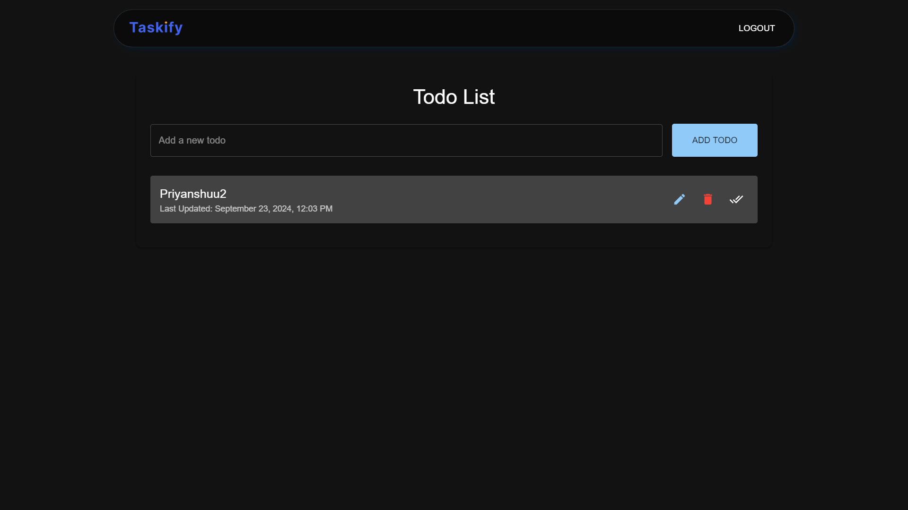

# 🚀 Todo List Application

Welcome to the **Todo List Application**, a robust and user-friendly platform built with **React**, **TypeScript**, **Material-UI (MUI)**, and **Vite**. This application leverages **Firebase** for authentication and real-time data management, ensuring a seamless and secure experience for managing your daily tasks. Deployed on **Vercel** and version-controlled on **GitHub**, this app is designed for both performance and scalability.

---

## 📋 Table of Contents

- [Features](#features)
- [Demo](#demo)
- [Technologies Used](#technologies-used)
- [Getting Started](#getting-started)
  - [Prerequisites](#prerequisites)
  - [Installation](#installation)
  - [Configuration](#configuration)
- [Usage](#usage)
- [Deployment](#deployment)
- [Contributing](#contributing)
- [License](#license)
- [Contact](#contact)
- [Acknowledgements](#acknowledgements)

---

## ✨ Features

- **User Authentication**: Secure signup and login using Firebase Authentication.
- **Real-time Data Management**: Add, update, delete, and fetch todos in real-time with Firebase Firestore.
- **Responsive Design**: Optimized for various screen sizes, ensuring a seamless experience on mobile and desktop.
- **Interactive UI**: Smooth animations with `react-flip-toolkit` and intuitive UI components from Material-UI.
- **Feedback Mechanisms**: Instant feedback through toast notifications (`react-hot-toast`) and loading indicators.
- **Secure Data Access**: Firestore security rules ensuring users can only access their own todos.
- **Deployment**: Live deployment on Vercel for instant access.
- **Optimistic UI Updates**: Immediate UI feedback during CRUD operations for enhanced user experience.

---

## 🎥 Demo

Experience the Todo List Application live! [Click here to view the live demo](https://taskify-react-ts.vercel.app/todos).

---

## 🛠 Technologies Used

### **Frontend:**

- [React](https://reactjs.org/) - JavaScript library for building user interfaces.
- [TypeScript](https://www.typescriptlang.org/) - Typed superset of JavaScript.
- [Vite](https://vitejs.dev/) - Next Generation Frontend Tooling.
- [Material-UI (MUI)](https://mui.com/) - React UI framework for designing responsive interfaces.
- [React Flip Toolkit](https://github.com/aholachek/react-flip-toolkit) - For smooth animations.
- [React Hot Toast](https://react-hot-toast.com/) - For toast notifications.

### **Backend:**

- [Firebase Authentication](https://firebase.google.com/products/auth) - User authentication services.
- [Firebase Firestore](https://firebase.google.com/products/firestore) - NoSQL cloud database.

### **Deployment:**

- [Vercel](https://vercel.com/) - Platform for deploying frontend applications.
- [GitHub](https://github.com/) - Version control and source code management.
